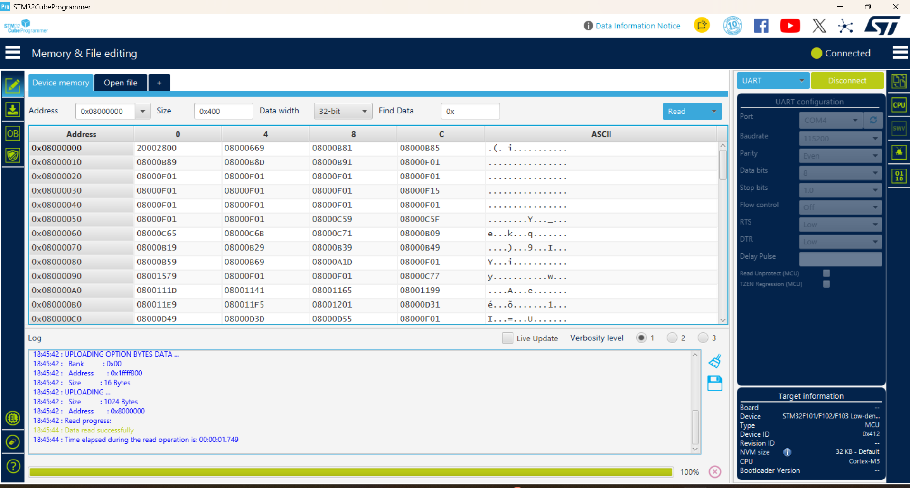
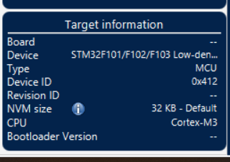
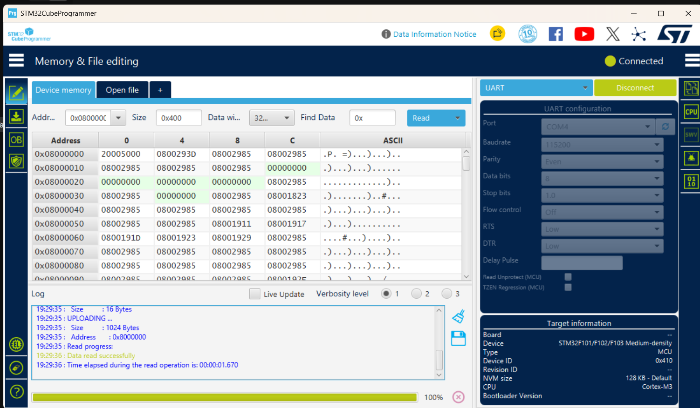
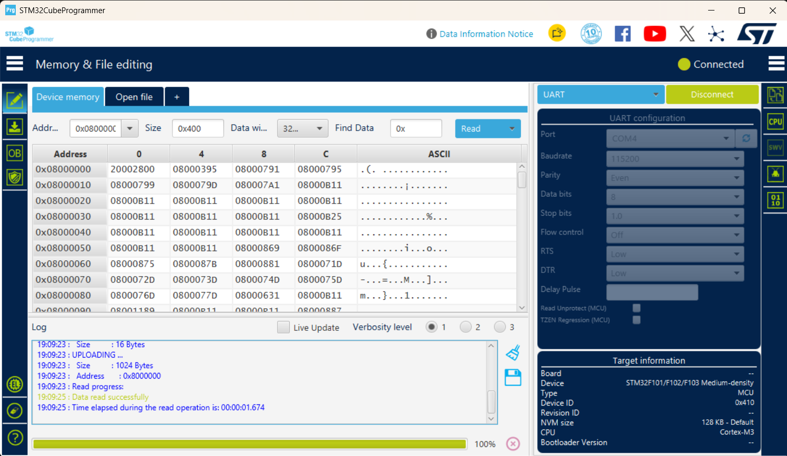

# Learning STM32: Three STM32F103 Boards in the Arduino IDE

Notes from programming three STM32F103 development boards in the **Arduino IDE 2.3.9** on Windows. All three boards have an STM32F103 chip, but they differ in:

- PCB color and layout
- the exact chip and its flash/RAM size
- the built-in LED pin
- the menu selection needed in the Arduino IDE

Each board was tested with:

- **2 Arduino cores:** the **Roger Clark core** (community, libmaple-based) and the **official STM32 core** (STMicroelectronics, HAL-based)
- **2 upload methods:** an **ST-Link V2** (SWD) and a **USB-to-TTL serial adapter** (built-in UART bootloader)

All 12 combinations (3 boards × 2 cores × 2 upload methods) work.

---

## Table of Contents

1. [Quick Comparison](#quick-comparison)
2. [Chip Differences (C6 vs C8 vs CB)](#chip-differences-c6-vs-c8-vs-cb)
3. [Arduino Cores Used](#arduino-cores-used)
4. [Board 1: Blue, STM32F103C6T6A](#board-1-blue-stm32f103c6t6a-older-board)
5. [Board 2: Blue, STM32F103C8T6](#board-2-blue-stm32f103c8t6)
6. [Board 3: Black, STM32F103CBT6](#board-3-black-stm32f103cbt6)
7. [Pinout Differences: Blue vs Black Board](#pinout-differences-blue-vs-black-board)
8. [Upload Method A: ST-Link V2](#upload-method-a-st-link-v2-swd)
9. [Upload Method B: USB-to-TTL Serial](#upload-method-b-usb-to-ttl-serial-adapter)
10. [Serial Monitor](#serial-monitor)
11. [Blink Test Sketch](#blink-test-sketch)
12. [Verifying the Chips (STM32CubeProgrammer + ChipCheck sketch)](#verifying-the-chips)
13. [Troubleshooting](#troubleshooting)
14. [Reference Links](#reference-links)

---

## Quick Comparison

| | **Board 1** | **Board 2** | **Board 3** |
|---|---|---|---|
| **Photo** |  |  |  |
| **PCB color** | Blue (older board) | Blue | Black (silkscreen "HW-621") |
| **Chip** | STM32F103**C6**T6A | STM32F103**C8**T6 | STM32F103**CB**T6 |
| **Flash / RAM (datasheet)** | 32 KB / 10 KB | 64 KB / 20 KB | 128 KB / 20 KB |
| **Built-in LED** | **PC13** | **PC13** | **PB12** |
| **Header pins** | 2 × 20 | 2 × 20 | 2 × 17 (no 5V, PC14, PC15, VBAT) |
| **Roger Clark core** | STM32F1xx/GD32F1xx boards → **Generic STM32F103C6/fake STM32F103C8** | same as Board 1 | same as Board 1 |
| **Official STM32 core** | Generic STM32F1 series → **BluePill F103C6 (32K)** | Generic STM32F1 series → **BluePill F103CB (or C8 with 128k)** | Generic STM32F1 series → **BlackPill F103CB (or C8 with 128k)** |
| **ST-Link upload** | ✅ Works | ✅ Works | ✅ Works |
| **USB-TTL serial upload** | ✅ Works | ✅ Works | ✅ Works |

> **Main differences:**
> - In the official core, only **Board 1** needs the **C6 (32K)** part number. Boards 2 and 3 use the **F103CB (or C8 with 128k)** part number.
> - Only **Board 3 (black)** has its LED on **PB12**. Boards 1 and 2 use **PC13**.
> - The **Roger Clark core** uses **the same board selection for all three boards**.

---

## Chip Differences (C6 vs C8 vs CB)

The letters after `STM32F103` describe the chip:

```
STM32 F 103  C   8   T  6
             │   │   │  └─ temperature range: 6 = -40…85 °C
             │   │   └──── package: T = LQFP
             │   └──────── flash size: 6 = 32 KB, 8 = 64 KB, B = 128 KB
             └──────────── pin count: C = 48 pins
```

All three chips are 72 MHz ARM Cortex-M3 parts in the same 48-pin package, so their pins match. The **C6** is a *low-density* device, so it has less memory **and fewer peripherals**:

| Feature | **C6** (Board 1) | **C8** (Board 2) | **CB** (Board 3) |
|---|---|---|---|
| Density class | Low-density | Medium-density | Medium-density |
| Flash | 32 KB | 64 KB | 128 KB |
| RAM | 10 KB | 20 KB | 20 KB |
| USART | 2 (USART1, USART2) | 3 (USART1–3) | 3 (USART1–3) |
| SPI | 1 (SPI1) | 2 (SPI1, SPI2) | 2 (SPI1, SPI2) |
| I²C | 1 (I2C1) | 2 (I2C1, I2C2) | 2 (I2C1, I2C2) |
| General-purpose timers | TIM2, TIM3 | TIM2, TIM3, TIM4 | TIM2, TIM3, TIM4 |
| Advanced timer | TIM1 | TIM1 | TIM1 |
| ADC | 2 × 12-bit, 10 channels | 2 × 12-bit, 10 channels | 2 × 12-bit, 10 channels |
| USB (full speed) / CAN | ✅ / ✅ | ✅ / ✅ | ✅ / ✅ |

> ⚠️ On **Board 1 (C6)**, `Serial3`, `SPI2` (PB12–PB15), `I2C2` (PB10/PB11) and `TIM4` (PB6–PB9 PWM) **do not exist**. Code that uses them compiles on the C8/CB boards but won't work on the C6.

> 📝 **About C8 chips with 128 KB:** many STM32F103**C8** chips contain 128 KB of flash, but ST only guarantees the first 64 KB. That's why the official core has a part number called "F103CB **(or C8 with 128k)**".

> 🔬 This table comes from the datasheets. See [Verifying the Chips](#verifying-the-chips) for how each board was tested and the measured results.

---

## Arduino Cores Used

Add both URLs in **File → Preferences → Additional Boards Manager URLs** (one per line):

```
https://dan.drown.org/stm32duino/package_STM32duino_index.json
https://github.com/stm32duino/BoardManagerFiles/raw/main/package_stmicroelectronics_index.json
```

Then open **Tools → Board → Boards Manager** and install both packages.

### 1. Roger Clark core (community "Arduino_STM32")

| | |
|---|---|
| **Boards Manager URL** | `https://dan.drown.org/stm32duino/package_STM32duino_index.json` |
| **Menu name in the IDE** | *Tools → Board → **STM32F1xx/GD32F1xx boards*** |
| **Source code** | https://github.com/rogerclarkmelbourne/Arduino_STM32 |
| **Based on** | libmaple (Leaflabs Maple), maintained by Roger Clark and the community |
| **Status** | Old and no longer actively developed, but still popular in Blue Pill tutorials. It's lightweight and compiles fast. |
| **Note** | It uses the ARM compiler from **Arduino SAM Boards (32-bits ARM Cortex-M3)**. Install that package too if compiling fails. |


*Roger Clark core: Tools → Board → STM32F1xx/GD32F1xx boards → Generic STM32F103C6/fake STM32F103C8.*

Settings used for all three boards:

| Tools menu | Selection |
|---|---|
| Board | **Generic STM32F103C6/fake STM32F103C8** |
| CPU Speed(MHz) | 72Mhz (Normal) |
| Optimize | Smallest (default) |
| Upload method | **Serial** (USB-TTL) *or* **STLink** (ST-Link V2) |
| Port | USB-TTL COM port (e.g. `COM4`). Only needed for Serial upload. |

### 2. Official STM32 core (STMicroelectronics "STM32duino")

| | |
|---|---|
| **Boards Manager URL** | `https://github.com/stm32duino/BoardManagerFiles/raw/main/package_stmicroelectronics_index.json` |
| **Menu name in the IDE** | *Tools → Board → **STM32 MCU based boards*** |
| **Source code** | https://github.com/stm32duino/Arduino_Core_STM32 |
| **Based on** | ST's official HAL / LL drivers (STM32Cube) |
| **Status** | Actively maintained by ST. Supports almost every STM32 family (F0, F1, F4, G0, L4, H7…). |
| **Note** | Uploading uses **STM32CubeProgrammer**, which must be installed separately: https://www.st.com/en/development-tools/stm32cubeprog.html |

Settings shared by all three boards (the only difference is **Board part number**):

| Tools menu | Selection |
|---|---|
| Board | **Generic STM32F1 series** |
| Board part number | *depends on the board, see below* |
| Debug symbols and core logs | None |
| Optimize | Smallest (-Os default) |
| C Runtime Library | Newlib Nano (default) |
| Upload method | **STM32CubeProgrammer (Serial)** (USB-TTL) *or* **STM32CubeProgrammer (SWD)** (ST-Link) |
| USB support (if available) | None |
| U(S)ART support | Enabled (generic 'Serial') |
| Port | USB-TTL COM port. Only needed for Serial upload. |

### Core comparison

| Feature | Roger Clark core | Official STM32 core |
|---|---|---|
| Maintained by | Community (Roger Clark and others) | STMicroelectronics |
| Board menu | *STM32F1xx/GD32F1xx boards* → *Generic STM32F103C6/fake STM32F103C8* | *STM32 MCU based boards* → *Generic STM32F1 series* → *Board part number* |
| Chip selection | In the board name | In the *Board part number* menu |
| ST-Link upload | *Upload method → STLink* | *Upload method → STM32CubeProgrammer (SWD)* |
| Serial upload | *Upload method → Serial* (uses `stm32flash`) | *Upload method → STM32CubeProgrammer (Serial)* |
| Extra software needed | Arduino SAM Boards package (compiler) | STM32CubeProgrammer |
| `LED_BUILTIN` | PC13 for this board selection | Set by the part number (PC13 for BluePill, PB12 for BlackPill) |
| Code size / compile speed | Smaller and faster | Larger (HAL), slower to compile |
| Families supported | STM32F1 (+ GD32F1) only | Almost every STM32 family |

> ⚠️ **Roger core on Boards 2 and 3:** "Generic STM32F103C6/fake STM32F103C8" builds for a C6 chip, so the compiler only allows **32 KB flash and 10 KB RAM**. This is fine for small sketches. For larger sketches on the C8/CB boards, pick **Generic STM32F103C series** and choose the 64k or 128k variant instead.

---

## Board 1: Blue, STM32F103C6T6A (older board)


| Property | Value |
|---|---|
| PCB color | Blue (older version, silkscreen "V218/936") |
| Chip | **STM32F103C6T6A** |
| Flash / RAM | **32 KB / 10 KB** (smallest of the three) |
| Built-in LED | **PC13** (plus a PWR LED) |
| Jumpers | BOOT0 / BOOT1 (yellow jumpers next to the micro-USB) |
| Crystals | 8 MHz main + 32.768 kHz RTC |
| Upload methods tested | ST-Link ✅, USB-TTL serial ✅ |

### Roger Clark core settings

See [Roger Clark core](#1-roger-clark-core-community-arduino_stm32): **Generic STM32F103C6/fake STM32F103C8**, Upload method **Serial** or **STLink**.

### Official STM32 core settings


| Tools menu | Selection |
|---|---|
| Board | **Generic STM32F1 series** |
| Board part number | **BluePill F103C6 (32K)** |
| Upload method | **STM32CubeProgrammer (SWD)** *or* **STM32CubeProgrammer (Serial)** |

> ⚠️ With only 32 KB of flash, large official-core sketches (e.g. ones using `Serial`, `Wire` and `SPI` together) run out of space quickly. Check the flash usage printed after each compile. The Roger core produces smaller code on this board.

---

## Board 2: Blue, STM32F103C8T6


| Property | Value |
|---|---|
| PCB color | Blue ("Blue Pill") |
| Chip | **STM32F103C8T6** (ST logo) |
| Flash / RAM | 64 KB / 20 KB per datasheet (many C8 chips actually contain 128 KB) |
| Built-in LED | **PC13** (plus a PWR LED) |
| Jumpers | BOOT0 / BOOT1 |
| Crystals | 8 MHz main + 32.768 kHz RTC |
| Upload methods tested | ST-Link ✅, USB-TTL serial ✅ |

### Roger Clark core settings

Same as Board 1: **Generic STM32F103C6/fake STM32F103C8**, Upload method **Serial** or **STLink**.

### Official STM32 core settings


| Tools menu | Selection |
|---|---|
| Board | **Generic STM32F1 series** |
| Board part number | **BluePill F103CB (or C8 with 128k)** |
| Upload method | **STM32CubeProgrammer (SWD)** *or* **STM32CubeProgrammer (Serial)** |

> 📝 The chip is marked **C8**, but this board is programmed with the **BluePill F103CB (or C8 with 128k)** option. "BluePill F103C8" and "BluePill F103CB" share the same pin mapping (PC13 LED, same pins). The only difference is the flash size the linker allows (64 KB vs 128 KB). If a sketch grows past 64 KB, the upload only works if the chip really has the extra flash. **Measured:** this board's C8 does have 128 KB of working flash (see [Board 2 results](#results-board-2-blue-stm32f103c8t6)).

---

## Board 3: Black, STM32F103CBT6


| Property | Value |
|---|---|
| PCB color | **Black** (silkscreen "HW-621") |
| Chip | **STM32F103CBT6** |
| Flash / RAM | **128 KB / 20 KB** (largest of the three) |
| Built-in LED | **PB12** ⚠️ (not PC13!) |
| Jumpers | **B0+ / B0−** and **B1+ / B1−** (jumper on "+" = 1, on "−" = 0) |
| SWD header | Yellow 4-pin: **3V3, DIO, CLK, GND** (labelled on the board) |
| Crystals | 8 MHz main + 32.768 kHz RTC |
| Upload methods tested | ST-Link ✅, USB-TTL serial ✅ |

### Roger Clark core settings

Same as Boards 1 and 2: **Generic STM32F103C6/fake STM32F103C8**, Upload method **Serial** or **STLink**.

> ⚠️ In the Roger core, `LED_BUILTIN` is **PC13**, but this board's LED is on **PB12**. Write `PB12` in your sketch.

### Official STM32 core settings


| Tools menu | Selection |
|---|---|
| Board | **Generic STM32F1 series** |
| Board part number | **BlackPill F103CB (or C8 with 128k)** |
| Upload method | **STM32CubeProgrammer (SWD)** *or* **STM32CubeProgrammer (Serial)** |

> 📝 **BlackPill vs BluePill part number:** both are the same F103CB chip, so both compile and upload. The difference is `LED_BUILTIN`:
> - **BlackPill F103CB** → `LED_BUILTIN = PB12` ✅ matches this board
> - **BluePill F103CB** → `LED_BUILTIN = PC13` ❌ the LED won't blink unless you write `PB12` yourself

---

## Pinout Differences: Blue vs Black Board

The chip pins are identical, but the boards break them out differently. These are the header labels as printed on my boards (with the SWD header on the left).

### Blue boards (Board 1 and Board 2): 2 × 20 pins

| Row | Pins (left → right) |
|---|---|
| **Top** | 3.3, G, 5V, B9, B8, B7, B6, B5, B4, B3, A15, A12, A11, A10, A9, A8, B15, B14, B13, B12 |
| **Bottom** | VB, C13, C14, C15, A0, A1, A2, A3, A4, A5, A6, A7, B0, B1, B10, B11, R, 3.3, G, G |

### Black board (Board 3, HW-621): 2 × 17 pins

| Row | Pins (left → right) |
|---|---|
| **Top** | B11, B10, B1, B0, A7, A6, A5, A4, A3, A2, A1, A0, RST, C13, B9, B8, GND |
| **Bottom** | B12, B13, B14, B15, A8, A9, A10, A11, A12, A15, B3, B4, B5, B6, B7, V3.3, GND |

### What's different

| | Blue boards | Black board |
|---|---|---|
| 5V pin | ✅ Yes | ❌ No. Power it from micro-USB or **V3.3** |
| PC14 / PC15 | ✅ Broken out | ❌ Not broken out (used by the 32.768 kHz crystal) |
| VBAT pin | ✅ VB | ❌ No |
| LED | PC13 | **PB12**. That pin is also SPI2_NSS, so the LED flickers if you use SPI2 |
| Boot jumpers | BOOT0 / BOOT1 | B0± / B1± |
| Mounting holes | ❌ | ✅ 4 holes |

> ⚠️ PA13/PA14 are the SWD pins. Don't use them as GPIO, or ST-Link uploads will need the "hold RESET" trick (see [Troubleshooting](#troubleshooting)).

---

## Upload Method A: ST-Link V2 (SWD)

Connect the ST-Link V2 to the 4-pin SWD header at the end of the board:

| ST-Link V2 | STM32 board |
|---|---|
| **3.3V** | 3.3 / 3V3 |
| **GND** | GND |
| **SWDIO** | DIO / IO (PA13) |
| **SWCLK** | CLK / DCLK (PA14) |

- Leave **BOOT0 = 0** (normal position). No jumper change is needed.
- **Roger core:** *Upload method → STLink*
- **Official core:** *Upload method → STM32CubeProgrammer (SWD)*. STM32CubeProgrammer must be installed.
- No COM port is needed.
- Install the ST-Link USB driver if Windows doesn't recognize the programmer: https://www.st.com/en/development-tools/stsw-link009.html

> The order of the 4 pins differs between boards and ST-Link clones. Always match by the **labels**, not by position.

---

## Upload Method B: USB-to-TTL Serial Adapter

This method uses the UART bootloader built into every STM32F103 ROM, on **USART1 = PA9 / PA10**. Any CH340, CP2102 or FT232 adapter works.

| USB-TTL adapter | STM32 board |
|---|---|
| **TX** | **A10** (PA10 = USART1 RX) |
| **RX** | **A9** (PA9 = USART1 TX) |
| **GND** | G / GND |
| **3.3V** (or 5V) | 3.3 (blue boards: 5V also possible · black board: **V3.3 only**) |

> TX goes to RX, and RX goes to TX. PA9/PA10 are 5V-tolerant, so 5V adapters also work.

**Upload steps:**

1. Set **BOOT0 = 1** (blue boards: BOOT0 jumper to 1 · black board: B0 jumper to **+**). Leave BOOT1 at 0.
2. Press the **RESET** button. The chip starts in the serial bootloader.
3. In the Arduino IDE, select the adapter's **COM port** in *Tools → Port* (e.g. `COM4`).
4. **Roger core:** *Upload method → Serial* · **Official core:** *Upload method → STM32CubeProgrammer (Serial)*
5. Click **Upload**. The output shows lines like `Wrote address 0x08004f00 (85.09%)`.
6. When the upload finishes, set **BOOT0 back to 0** and press **RESET** so the sketch runs normally.

> If you forget step 6, the board goes back into the bootloader on every reset and your sketch won't run.

### Boot modes

| BOOT1 | BOOT0 | Starts from | Used for |
|---|---|---|---|
| x | **0** | Main flash | Normal operation, ST-Link upload |
| **0** | **1** | System memory (ROM bootloader) | USB-TTL serial upload |
| 1 | 1 | SRAM | Not used here |

---

## Serial Monitor

With the settings above (*USB support: None*), `Serial` is **USART1 on PA9/PA10** in both cores. That's the same pins as the USB-TTL adapter, so after a serial upload (BOOT0 = 0, RESET) you can open **Tools → Serial Monitor** on the same COM port without re-wiring.

```cpp
void setup() {
  Serial.begin(115200);
}

void loop() {
  Serial.println("Hello from STM32F103");
  delay(1000);
}
```

> The micro-USB connector on these boards only provides **power** with these settings. USB serial (CDC) needs *USB support: CDC* in the official core or a USB bootloader in the Roger core. Many blue boards also have the wrong USB pull-up resistor (R10 = 10 kΩ instead of 1.5 kΩ), which can stop USB from being detected on some PCs.

---

## Blink Test Sketch

This sketch works on all three boards. Uncomment the line for the board you're using:

```cpp
// Choose the LED pin for your board
#define LED_PIN PC13      // Board 1 (blue C6) and Board 2 (blue C8)
// #define LED_PIN PB12   // Board 3 (black CB)

void setup() {
  pinMode(LED_PIN, OUTPUT);
}

void loop() {
  digitalWrite(LED_PIN, LOW);   // on-board LEDs are usually active-LOW: LOW = ON
  delay(500);
  digitalWrite(LED_PIN, HIGH);  // HIGH = OFF
  delay(500);
}
```

> With the official core and the correct part number (BluePill for boards 1–2, BlackPill for board 3), `LED_BUILTIN` already points to the right pin, so you can use it instead of `LED_PIN`.

---

## Verifying the Chips

The [chip table](#chip-differences-c6-vs-c8-vs-cb) comes from ST's datasheets. To check that each board really has what the datasheet says (and not a relabeled or clone chip), I used two methods:

1. **STM32CubeProgrammer:** the chip reports its **Device ID**, which tells the density class.
2. **[ChipCheck.ino](ChipCheck/ChipCheck.ino)** sketch: tests the **real** RAM, flash and peripherals on the board.

### Method 1: STM32CubeProgrammer

1. Open **STM32CubeProgrammer**.
2. Connect with **ST-LINK**, or with **UART** through the USB-TTL adapter (BOOT0 = 1, then press RESET; Port = your COM port, 115200 baud, Even parity).
3. Click **Connect** and look at the **Target information** panel.

| Field | Low-density (C6) | Medium-density (C8 / CB) |
|---|---|---|
| Device ID | **0x412** | **0x410** |
| Device | STM32F101/F102/F103 Low-density | STM32F101/F102/F103 Medium-density |

> ⚠️ "NVM size: 32 KB - **Default**" means CubeProgrammer uses its built-in default for that Device ID. It doesn't read the size from the chip. To read the chip's own flash size register, enter Address `0x1FFFF7E0`, Size `4`, Data width `16-bit` in *Memory & File editing* and click **Read**. The first value is the size in KB, in hex (`0020` = 32 KB).
>
> Click **Disconnect** before uploading from the Arduino IDE. CubeProgrammer keeps the COM port busy while it's connected.

### Method 2: ChipCheck sketch

[ChipCheck/ChipCheck.ino](ChipCheck/ChipCheck.ino) talks directly to the chip's registers, so it works with **both cores** and on **all three boards**. It prints its report on **USART1 (PA9/PA10)**, which is the same USB-TTL adapter used for uploading.

| Test | How it works |
|---|---|
| Chip ID | Reads `DBGMCU_IDCODE`. On the F103 this reads **0** without a debugger (a known chip bug), so use CubeProgrammer for the ID. |
| Flash size register | Reads the 16-bit value ST writes at `0x1FFFF7E0` at the factory |
| Unique ID | Reads the 96-bit ID at `0x1FFFF7E8` (different on every chip) |
| **RAM** | Writes and reads back one word in every 1 KB block until one fails |
| **Flash readable** | Reads every 1 KB of flash until an address doesn't exist |
| **Flash write test** | At 32, 63, 64 and 127 KB: erases the page, writes a pattern, checks it and erases again. This shows whether a "64 KB" C8 really has 128 KB. |
| **Peripherals** | Turns on each peripheral's clock, writes a test value to one register and reads it back. A peripheral that doesn't exist reads back 0. |

**Safety:**
- Reading or writing memory that doesn't exist would normally crash the chip (a *HardFault*). The sketch sets two Cortex-M3 options (`FAULTMASK` + `CCR.BFHFNMIGN`) so that such an access sets a flag instead.
- Every value it changes is put back afterwards.
- The flash test only touches pages at **32 KB and above**, and skips any page that isn't blank, so it can never erase the sketch itself (about 12–17 KB).

**How to run it** (official core; the Roger core works too):

| Setting | Board 1 (C6) | Board 2 (C8) | Board 3 (CB) |
|---|---|---|---|
| Board | Generic STM32F1 series | Generic STM32F1 series | Generic STM32F1 series |
| Board part number | BluePill F103C6 (32K) | BluePill F103CB (or C8 with 128k) | BlackPill F103CB (or C8 with 128k) |
| U(S)ART support | Enabled (generic 'Serial') | same | same |

1. Upload the sketch as usual (serial or ST-Link).
2. Set **BOOT0 = 0** and open **Serial Monitor at 115200 baud**.
3. Press **RESET**. The report prints after about 2 seconds.

> 📝 **What I learned while writing it:** turning on a peripheral's clock is **not** a valid presence test. On the C6, the clock-enable bits for the missing USART3, SPI2, I2C2 and TIM4 still read back as 1. Only writing a register and reading it back tells whether the peripheral exists.

<details>
<summary><b>Show the full ChipCheck.ino code</b></summary>

```cpp
// ChipCheck: finds out what the STM32F103 on a board really has.
//
// Prints (on USART1 = PA9/PA10, 115200 baud, through the USB-TTL adapter):
//   - chip ID (DEV_ID: 0x412 = low-density, 0x410 = medium-density)
//   - flash size written into the chip by ST at the factory
//   - real RAM size, real flash size, and whether the extra flash can be written
//   - which peripherals (USART, SPI, I2C, TIM, ADC, USB, CAN) really exist
//
// Works with both the Roger Clark core and the official STM32 core.
// Upload it, set BOOT0 = 0, open the Serial Monitor at 115200 and press RESET.
//
// Safety: the flash test only touches pages at 32 KB and above, and skips any page
// that isn't blank, so it never erases the sketch itself (keep the sketch < 32 KB).

#include <Arduino.h>

#if defined(ARDUINO_ARCH_STM32)
  #define OUT Serial      // official core: Serial = USART1 (PA9/PA10)
#else
  #define OUT Serial1     // Roger Clark core: Serial1 = USART1 (PA9/PA10)
#endif

#define MMIO32(a) (*(volatile uint32_t *)(a))
#define MMIO16(a) (*(volatile uint16_t *)(a))

// Cortex-M3 system registers
#define A_ACTLR          0xE000E008
#define A_SCB_CCR        0xE000ED14
#define A_SCB_CFSR       0xE000ED28
#define A_DBGMCU_IDCODE  0xE0042000

// STM32F1 registers
#define A_FLASH_SIZE     0x1FFFF7E0
#define A_UID            0x1FFFF7E8
#define A_RCC_CR         0x40021000
#define A_RCC_APB2ENR    0x40021018
#define A_RCC_APB1ENR    0x4002101C
#define A_FLASH_KEYR     0x40022004
#define A_FLASH_SR       0x4002200C
#define A_FLASH_CR       0x40022010
#define A_FLASH_AR       0x40022014

#define SRAM_START   0x20000000UL
#define FLASH_START  0x08000000UL

// ---------------------------------------------------------------------------
// Fault-safe memory access: while FAULTMASK is set and CCR.BFHFNMIGN = 1, a read
// or write to memory that doesn't exist sets a flag instead of crashing.

static void probeBegin() {
  __asm volatile("cpsid f");                // run at priority -1, all interrupts off
  MMIO32(A_ACTLR) |= 2;                     // DISDEFWBUF: make every bus fault precise
  MMIO32(A_SCB_CCR) |= (1UL << 8);          // BFHFNMIGN: ignore bus faults at priority -1
  MMIO32(A_SCB_CFSR) = 0xFF00;              // clear old bus fault flags
  __asm volatile("dsb\n isb");
}

static bool busFaulted() {
  __asm volatile("dsb\n isb");
  return MMIO32(A_SCB_CFSR) & 0xFF00;
}

// Returns true if a bus fault happened since probeBegin().
static bool probeEnd() {
  bool fault = busFaulted();
  MMIO32(A_SCB_CFSR) = 0xFF00;
  MMIO32(A_SCB_CCR) &= ~(1UL << 8);
  MMIO32(A_ACTLR) &= ~2UL;
  __asm volatile("cpsie f");
  return fault;
}

static bool canRead(uint32_t addr) {
  probeBegin();
  (void)MMIO32(addr);
  return !probeEnd();
}

// Read/write test of one RAM word; the old value is put back.
static bool ramWordWorks(uint32_t addr) {
  probeBegin();
  uint32_t old = MMIO32(addr);
  bool ok = !busFaulted();
  if (ok) {
    MMIO32(addr) = 0xA5A5F00F;
    ok = MMIO32(addr) == 0xA5A5F00F;
    MMIO32(addr) = 0x5A5A0FF0;
    ok = ok && MMIO32(addr) == 0x5A5A0FF0;
    MMIO32(addr) = old;
  }
  return !probeEnd() && ok;
}

// ---------------------------------------------------------------------------
// Flash programming (1 KB pages on low/medium-density chips)

static bool flashWait() {
  while (MMIO32(A_FLASH_SR) & 1) {}         // BSY
  uint32_t sr = MMIO32(A_FLASH_SR);
  MMIO32(A_FLASH_SR) = 0x34;                // clear EOP, WRPRTERR, PGERR
  return !(sr & 0x14);
}

static bool flashErasePage(uint32_t addr) {
  MMIO32(A_FLASH_CR) |= 2;                  // PER
  MMIO32(A_FLASH_AR) = addr;
  MMIO32(A_FLASH_CR) |= 0x40;               // STRT
  bool ok = flashWait();
  MMIO32(A_FLASH_CR) &= ~2UL;
  return ok;
}

static bool pageIsBlank(uint32_t addr) {
  for (uint32_t i = 0; i < 1024; i += 4)
    if (MMIO32(addr + i) != 0xFFFFFFFF) return false;
  return true;
}

// 0 = OK, 1 = not present, 2 = not blank (skipped), 3 = write failed
static int flashPageTest(uint32_t addr) {
  if (!canRead(addr)) return 1;
  probeBegin();
  bool blank = pageIsBlank(addr);
  bool fault = probeEnd();
  if (fault) return 1;
  if (!blank) return 2;

  MMIO32(A_RCC_CR) |= 1;                    // HSI must be on to program flash
  while (!(MMIO32(A_RCC_CR) & 2)) {}
  if (MMIO32(A_FLASH_CR) & 0x80) {          // LOCK: unlock with the two keys
    MMIO32(A_FLASH_KEYR) = 0x45670123;
    MMIO32(A_FLASH_KEYR) = 0xCDEF89AB;
  }

  probeBegin();
  bool ok = true;
  for (uint32_t i = 0; i < 8 && ok; i++) {
    MMIO32(A_FLASH_CR) |= 1;                // PG
    MMIO16(addr + 2 * i) = 0x1230 + i;
    ok = flashWait();
    MMIO32(A_FLASH_CR) &= ~1UL;
    ok = ok && MMIO16(addr + 2 * i) == 0x1230 + i;
  }
  flashErasePage(addr);                     // leave the page blank again
  if (probeEnd()) ok = false;
  MMIO32(A_FLASH_CR) |= 0x80;               // lock again
  return ok ? 0 : 3;
}

// ---------------------------------------------------------------------------
// Peripheral check: turn on the peripheral's clock, write a test value to one of
// its registers and read it back. A missing peripheral reads back 0.
// (The RCC clock-enable bit is NOT a useful test: on a real C6 the bits for the
// missing USART3/SPI2/I2C2/TIM4 still read back as 1.)

struct Periph {
  const char *name;
  bool onAPB2;       // clock enable in RCC_APB2ENR (else RCC_APB1ENR)
  uint8_t bit;       // clock enable bit
  uint32_t testReg;  // harmless register to write/read back
  uint32_t value;    // test value (only bits the register really stores)
};

static const Periph periphs[] = {
  {"USART1", true,  14, 0x40013808, 0},        // BRR; in use by Serial, only read
  {"USART2", false, 17, 0x40004408, 0x123},    // BRR
  {"USART3", false, 18, 0x40004808, 0x123},    // BRR
  {"SPI1",   true,  12, 0x40013010, 0x123},    // CRCPR
  {"SPI2",   false, 14, 0x40003810, 0x123},    // CRCPR
  {"I2C1",   false, 21, 0x40005408, 0x123},    // OAR1
  {"I2C2",   false, 22, 0x40005808, 0x123},    // OAR1
  {"TIM1",   true,  11, 0x40012C2C, 0x123},    // ARR
  {"TIM2",   false,  0, 0x4000002C, 0x123},    // ARR
  {"TIM3",   false,  1, 0x4000042C, 0x123},    // ARR
  {"TIM4",   false,  2, 0x4000082C, 0x123},    // ARR
  {"ADC1",   true,   9, 0x40012414, 0x123},    // JOFR1
  {"ADC2",   true,  10, 0x40012814, 0x123},    // JOFR1
  {"USB",    false, 23, 0x40005C50, 0x128},    // BTABLE (bits 15:3)
  {"CAN",    false, 25, 0x40006640, 0x123},    // filter bank 0 FR1 (writable while FINIT = 1, the reset state)
};

static void checkPeriph(size_t index) {
  const Periph &p = periphs[index];
  uint32_t enReg = p.onAPB2 ? A_RCC_APB2ENR : A_RCC_APB1ENR;
  uint32_t oldEn = MMIO32(enReg);
  MMIO32(enReg) = oldEn | (1UL << p.bit);

  bool ok;
  probeBegin();
  uint32_t old = MMIO32(p.testReg);
  if (p.value == 0) {
    ok = old != 0;                          // in use: a live register isn't 0
  } else {
    MMIO32(p.testReg) = p.value;
    ok = MMIO32(p.testReg) == p.value;
    MMIO32(p.testReg) = old;
  }
  if (probeEnd()) ok = false;
  MMIO32(enReg) = oldEn;                    // put the clock back how it was

  OUT.print("  ");
  OUT.print(p.name);
  for (size_t i = strlen(p.name); i < 8; i++) OUT.print(' ');
  OUT.print("register test: ");
  OUT.print(ok ? "OK  " : "FAIL");
  OUT.print("  => ");
  OUT.println(ok ? "present" : "NOT present");
}

// ---------------------------------------------------------------------------

static void printHex(uint32_t v, int digits) {
  OUT.print("0x");
  for (int i = digits - 1; i >= 0; i--) OUT.print((v >> (4 * i)) & 0xF, HEX);
}

static void runCheck() {
  OUT.println();
  OUT.println("========== STM32F103 chip check ==========");

  // 1. Chip ID
  uint32_t idcode = MMIO32(A_DBGMCU_IDCODE);
  uint32_t devId = idcode & 0xFFF;
  OUT.print("DBGMCU_IDCODE      : ");
  printHex(idcode, 8);
  if (idcode == 0) {
    OUT.println("  (reads 0 without a debugger - known F103 errata;");
    OUT.println("                      use STM32CubeProgrammer to see the Device ID)");
  } else {
    OUT.print("  DEV_ID ");
    printHex(devId, 3);
    OUT.print(" = ");
    switch (devId) {
      case 0x412: OUT.print("low-density (C4/C6)"); break;
      case 0x410: OUT.print("medium-density (C8/CB)"); break;
      case 0x414: OUT.print("high-density"); break;
      default:    OUT.print("unknown / not a genuine ST ID"); break;
    }
    OUT.print(", REV_ID ");
    printHex(idcode >> 16, 4);
    OUT.println();
  }

  // 2. Factory flash size register
  OUT.print("Flash size register: ");
  OUT.print(MMIO16(A_FLASH_SIZE));
  OUT.println(" KB  (what ST programmed into this chip)");

  OUT.print("Unique ID          : ");
  for (int i = 2; i >= 0; i--) { printHex(MMIO32(A_UID + 4 * i), 8); OUT.print(' '); }
  OUT.println();

  // 3. Real RAM size: test one word in every 1 KB block until one fails
  uint32_t ramKB = 0;
  while (ramKB < 64 && ramWordWorks(SRAM_START + ramKB * 1024 + 0x200)) ramKB++;
  OUT.print("RAM found          : ");
  OUT.print(ramKB);
  OUT.println(" KB");

  // 4. Real flash size: how far flash can be read
  uint32_t flashKB = 0;
  while (flashKB < 512 && canRead(FLASH_START + flashKB * 1024)) flashKB++;
  OUT.print("Flash readable     : ");
  OUT.print(flashKB);
  OUT.println(" KB");

  // 5. Can the flash above 32 KB really be written?
  OUT.println("Flash write test (erase -> program -> verify -> erase):");
  const uint32_t pagesKB[] = {32, 63, 64, 127};
  for (uint32_t kb : pagesKB) {
    uint32_t addr = FLASH_START + kb * 1024;
    OUT.print("  page at ");
    OUT.print(kb);
    OUT.print(" KB (");
    printHex(addr, 8);
    OUT.print("): ");
    switch (flashPageTest(addr)) {
      case 0: OUT.println("OK, writable"); break;
      case 1: OUT.println("not present"); break;
      case 2: OUT.println("not blank, skipped"); break;
      default: OUT.println("WRITE FAILED"); break;
    }
  }

  // 6. Peripherals
  OUT.println("Peripherals:");
  for (size_t i = 0; i < sizeof(periphs) / sizeof(periphs[0]); i++) checkPeriph(i);

  OUT.println("==========================================");
  OUT.println("Press RESET to run again.");
}

void setup() {
  OUT.begin(115200);
  delay(2000);          // time to open the Serial Monitor
  runCheck();
}

void loop() {
}
```

</details>

### Results: Board 1 (blue, STM32F103C6T6A)

**STM32CubeProgrammer** (UART, COM4):





- **Device ID 0x412**, *STM32F101/F102/F103 Low-density*, Cortex-M3 → confirms a low-density chip.
- The flash read at `0x08000000` worked, so the chip isn't read-protected.
- The first word `0x20002800` is the uploaded sketch's stack start (0x20000000 + 10 KB), so the sketch was built for 10 KB RAM.

**ChipCheck output** (official core, BluePill F103C6 (32K), serial upload):

```
========== STM32F103 chip check ==========
DBGMCU_IDCODE      : 0x00000000  (reads 0 without a debugger - known F103 errata;
                      use STM32CubeProgrammer to see the Device ID)
Flash size register: 32 KB  (what ST programmed into this chip)
Unique ID          : 0x43128168 0x36354D4B 0x05DDFF39
RAM found          : 10 KB
Flash readable     : 32 KB
Flash write test (erase -> program -> verify -> erase):
  page at 32 KB (0x08008000): not present
  page at 63 KB (0x0800FC00): not present
  page at 64 KB (0x08010000): not present
  page at 127 KB (0x0801FC00): not present
Peripherals:
  USART1  register test: OK    => present
  USART2  register test: OK    => present
  USART3  register test: FAIL  => NOT present
  SPI1    register test: OK    => present
  SPI2    register test: FAIL  => NOT present
  I2C1    register test: OK    => present
  I2C2    register test: FAIL  => NOT present
  TIM1    register test: OK    => present
  TIM2    register test: OK    => present
  TIM3    register test: OK    => present
  TIM4    register test: FAIL  => NOT present
  ADC1    register test: OK    => present
  ADC2    register test: OK    => present
  USB     register test: OK    => present
  CAN     register test: OK    => present
==========================================
Press RESET to run again.
```

**Datasheet vs measured:**

| Feature | Datasheet (C6) | Board 1 measured | Match |
|---|---|---|---|
| Device ID / density | 0x412, low-density | 0x412 (CubeProgrammer) | ✅ |
| Flash | 32 KB | 32 KB (register), nothing at 32 KB or above | ✅ |
| RAM | 10 KB | 10 KB | ✅ |
| USART | USART1, USART2 | USART1 ✅ USART2 ✅ USART3 ❌ | ✅ |
| SPI | SPI1 | SPI1 ✅ SPI2 ❌ | ✅ |
| I²C | I2C1 | I2C1 ✅ I2C2 ❌ | ✅ |
| General-purpose timers | TIM2, TIM3 | TIM2 ✅ TIM3 ✅ TIM4 ❌ | ✅ |
| Advanced timer | TIM1 | TIM1 ✅ | ✅ |
| ADC | ADC1, ADC2 | ADC1 ✅ ADC2 ✅ | ✅ |
| USB / CAN | ✅ / ✅ | ✅ / ✅ | ✅ |

> ✅ **Conclusion:** Board 1 is a **genuine STM32F103C6** on the low-density chip. Every result matches the datasheet. There is no hidden extra flash or RAM, and USART3, SPI2, I2C2 and TIM4 really don't exist on this chip.
>
> The ADC test only proves ADC1 and ADC2 exist. It doesn't test the 10 input channels (PA0–PA7, PB0, PB1).

### Results: Board 2 (blue, STM32F103C8T6)

**STM32CubeProgrammer** (UART, COM4):



- **Device ID 0x410**, *STM32F101/F102/F103 Medium-density*, Cortex-M3 → confirms a medium-density chip.
- "NVM size: 128 KB - **Default**" is only CubeProgrammer's default for ID 0x410 (it shows the same on the CB board). It is **not** read from this chip, whose flash size register says 64 KB.
- The first word `0x20005000` shows that the sketch in flash was built for **20 KB RAM** (official core, BluePill F103CB).

**ChipCheck output:**

```
========== STM32F103 chip check ==========
DBGMCU_IDCODE      : 0x00000000  (reads 0 without a debugger - known F103 errata;
                      use STM32CubeProgrammer to see the Device ID)
Flash size register: 64 KB  (what ST programmed into this chip)
Unique ID          : 0x87233958 0x57518366 0x0671FF49
RAM found          : 20 KB
Flash readable     : 128 KB
Flash write test (erase -> program -> verify -> erase):
  page at 32 KB (0x08008000): OK, writable
  page at 63 KB (0x0800FC00): OK, writable
  page at 64 KB (0x08010000): OK, writable
  page at 127 KB (0x0801FC00): OK, writable
Peripherals:
  USART1  register test: OK    => present
  USART2  register test: OK    => present
  USART3  register test: OK    => present
  SPI1    register test: OK    => present
  SPI2    register test: OK    => present
  I2C1    register test: OK    => present
  I2C2    register test: OK    => present
  TIM1    register test: OK    => present
  TIM2    register test: OK    => present
  TIM3    register test: OK    => present
  TIM4    register test: OK    => present
  ADC1    register test: OK    => present
  ADC2    register test: OK    => present
  USB     register test: OK    => present
  CAN     register test: OK    => present
==========================================
Press RESET to run again.
```

**Datasheet vs measured:**

| Feature | Datasheet (C8) | Board 2 measured | Match |
|---|---|---|---|
| Device ID / density | 0x410, medium-density | 0x410 (CubeProgrammer) | ✅ |
| Flash size register | 64 KB | **64 KB** | ✅ |
| Flash that actually exists | 64 KB | **128 KB** readable, writable at 64 KB and 127 KB | ⚠️ **More than the datasheet** |
| RAM | 20 KB | 20 KB | ✅ |
| USART | USART1–3 | USART1 ✅ USART2 ✅ USART3 ✅ | ✅ |
| SPI | SPI1, SPI2 | SPI1 ✅ SPI2 ✅ | ✅ |
| I²C | I2C1, I2C2 | I2C1 ✅ I2C2 ✅ | ✅ |
| General-purpose timers | TIM2, TIM3, TIM4 | TIM2 ✅ TIM3 ✅ TIM4 ✅ | ✅ |
| Advanced timer | TIM1 | TIM1 ✅ | ✅ |
| ADC | ADC1, ADC2 | ADC1 ✅ ADC2 ✅ | ✅ |
| USB / CAN | ✅ / ✅ | ✅ / ✅ | ✅ |

> ✅ **Conclusion:** Board 2 is a **genuine STM32F103C8** (factory register = 64 KB) with the **hidden 128 KB**. It uses the same chip as the CB, and the upper 64 KB can be read and written. This explains why the **BluePill F103CB (or C8 with 128k)** part number works on this board.
>
> ⚠️ **The upper 64 KB is not guaranteed by ST.** It wasn't tested at the factory for this part, and ChipCheck only wrote a few bytes on two pages there, so a bad page is possible. For important projects, keep the sketch under **64 KB**. If you go above 64 KB, make sure the upload **verifies**.

### Summary: all three boards

| | Board 1 (blue) | Board 2 (blue) | Board 3 (black) |
|---|---|---|---|
| Chip marking | STM32F103C6T6A | STM32F103C8T6 | STM32F103CBT6 |
| Device ID | 0x412 (low-density) | 0x410 (medium-density) | 0x410 (medium-density) |
| Flash size register | 32 KB | 64 KB | 128 KB |
| Flash that actually works | 32 KB | **128 KB** (hidden 64 KB) | 128 KB |
| RAM | 10 KB | 20 KB | 20 KB |
| USART3 / SPI2 / I2C2 / TIM4 | ❌ | ✅ | ✅ |
| Genuine ST chip | ✅ | ✅ | ✅ |

### Results: Board 3 (black, STM32F103CBT6)

**STM32CubeProgrammer** (UART, COM4):



- **Device ID 0x410**, *STM32F101/F102/F103 Medium-density*, Cortex-M3 → confirms a medium-density chip.
- "NVM size: 128 KB - Default" is CubeProgrammer's built-in default for this ID. The real size comes from the flash size register below.
- The first word `0x20002800` shows that the sketch in flash when this screenshot was taken was built for 10 KB RAM (e.g. the Roger "C6/fake C8" selection). It runs fine, because 10 KB fits inside the chip's 20 KB.

**ChipCheck output:**

```
========== STM32F103 chip check ==========
DBGMCU_IDCODE      : 0x00000000  (reads 0 without a debugger - known F103 errata;
                      use STM32CubeProgrammer to see the Device ID)
Flash size register: 128 KB  (what ST programmed into this chip)
Unique ID          : 0x67021922 0x51558877 0x0668FF55
RAM found          : 20 KB
Flash readable     : 128 KB
Flash write test (erase -> program -> verify -> erase):
  page at 32 KB (0x08008000): OK, writable
  page at 63 KB (0x0800FC00): OK, writable
  page at 64 KB (0x08010000): OK, writable
  page at 127 KB (0x0801FC00): OK, writable
Peripherals:
  USART1  register test: OK    => present
  USART2  register test: OK    => present
  USART3  register test: OK    => present
  SPI1    register test: OK    => present
  SPI2    register test: OK    => present
  I2C1    register test: OK    => present
  I2C2    register test: OK    => present
  TIM1    register test: OK    => present
  TIM2    register test: OK    => present
  TIM3    register test: OK    => present
  TIM4    register test: OK    => present
  ADC1    register test: OK    => present
  ADC2    register test: OK    => present
  USB     register test: OK    => present
  CAN     register test: OK    => present
==========================================
Press RESET to run again.
```

**Datasheet vs measured:**

| Feature | Datasheet (CB) | Board 3 measured | Match |
|---|---|---|---|
| Device ID / density | 0x410, medium-density | 0x410 (CubeProgrammer) | ✅ |
| Flash | 128 KB | 128 KB (register), readable and writable up to 127 KB | ✅ |
| RAM | 20 KB | 20 KB | ✅ |
| USART | USART1–3 | USART1 ✅ USART2 ✅ USART3 ✅ | ✅ |
| SPI | SPI1, SPI2 | SPI1 ✅ SPI2 ✅ | ✅ |
| I²C | I2C1, I2C2 | I2C1 ✅ I2C2 ✅ | ✅ |
| General-purpose timers | TIM2, TIM3, TIM4 | TIM2 ✅ TIM3 ✅ TIM4 ✅ | ✅ |
| Advanced timer | TIM1 | TIM1 ✅ | ✅ |
| ADC | ADC1, ADC2 | ADC1 ✅ ADC2 ✅ | ✅ |
| USB / CAN | ✅ / ✅ | ✅ / ✅ | ✅ |

> ✅ **Conclusion:** Board 3 is a **genuine STM32F103CB** on the medium-density chip. Every result matches the datasheet. The flash size register says **128 KB** and the full 128 KB can be written, so the **F103CB (or C8 with 128k)** part number is exactly right for this board.
>
> Compared with Board 1 (C6), this chip has **4× the flash, 2× the RAM**, plus USART3, SPI2, I2C2 and TIM4.

---

## Troubleshooting

| Problem | Likely cause / fix |
|---|---|
| Upload succeeds but the LED doesn't blink on the black board | Wrong pin. The black board uses **PB12**. Use the **BlackPill** part number or write `PB12`. |
| Serial upload: "Failed to init device" / timeout | BOOT0 isn't set to 1, you didn't press RESET, TX/RX are swapped, or the wrong COM port is selected. |
| Sketch doesn't run after a serial upload | BOOT0 is still 1. Set it back to 0 and press RESET. |
| Official core: "STM32CubeProgrammer not found" | Install STM32CubeProgrammer in its default location and restart the Arduino IDE. |
| ST-Link: "No ST-Link detected" | Install the ST-Link driver (STSW-LINK009) and try another USB port or cable. |
| ST-Link: "Can not connect to target" | Check the SWDIO/SWCLK wiring. If the sketch reuses PA13/PA14, **hold RESET**, start the upload, and release RESET when "Uploading…" appears. Or upload once via serial with BOOT0 = 1. |
| "Sketch too big" / "region FLASH overflowed" | Board 1 (C6) has only 32 KB, and the Roger "C6/fake C8" selection also limits Boards 2–3 to 32 KB. Use a larger variant or cut down the sketch. |
| Code uses `Serial3`, `SPI2` or `Wire` on PB10/PB11 and fails on Board 1 | The C6 (low-density) chip doesn't have USART3, SPI2, I2C2 or TIM4. |
| Roger core fails to compile (missing `arm-none-eabi-gcc`) | Install **Arduino SAM Boards (32-bits ARM Cortex-M3)** from the Boards Manager. |
| "Port: COM4 [not connected]" in the status bar | Normal when the board is in bootloader mode or the adapter is unplugged. Re-select the port after plugging in. |

---

## Reference Links

**Arduino cores**
- Roger Clark core (Boards Manager URL): https://dan.drown.org/stm32duino/package_STM32duino_index.json
- Roger Clark core source: https://github.com/rogerclarkmelbourne/Arduino_STM32
- Roger Clark core wiki: https://github.com/rogerclarkmelbourne/Arduino_STM32/wiki
- Official STM32 core (Boards Manager URL): https://github.com/stm32duino/BoardManagerFiles/raw/main/package_stmicroelectronics_index.json
- Official STM32 core source: https://github.com/stm32duino/Arduino_Core_STM32
- Official STM32 core wiki: https://github.com/stm32duino/Arduino_Core_STM32/wiki
- Official core, F1 variants (BluePill / BlackPill pin definitions): https://github.com/stm32duino/Arduino_Core_STM32/tree/main/variants/STM32F1xx
- STM32duino forum: https://www.stm32duino.com/

**ST tools and drivers**
- STM32CubeProgrammer: https://www.st.com/en/development-tools/stm32cubeprog.html
- ST-Link V2 USB driver (STSW-LINK009): https://www.st.com/en/development-tools/stsw-link009.html
- CH340 USB-TTL driver: https://www.wch-ic.com/downloads/CH341SER_EXE.html
- CP210x USB-TTL driver: https://www.silabs.com/developers/usb-to-uart-bridge-vcp-drivers

**Datasheets / chip pages**
- STM32F103C6 (low-density, 32 KB): https://www.st.com/en/microcontrollers-microprocessors/stm32f103c6.html
- STM32F103C8 (medium-density, 64 KB): https://www.st.com/en/microcontrollers-microprocessors/stm32f103c8.html
- STM32F103CB (medium-density, 128 KB): https://www.st.com/en/microcontrollers-microprocessors/stm32f103cb.html
- STM32F103 reference manual (RM0008): https://www.st.com/resource/en/reference_manual/rm0008-stm32f101xx-stm32f102xx-stm32f103xx-stm32f105xx-and-stm32f107xx-advanced-armbased-32bit-mcus-stmicroelectronics.pdf
- AN2606, STM32 system memory boot mode (serial bootloader): https://www.st.com/resource/en/application_note/an2606-stm32-microcontroller-system-memory-boot-mode-stmicroelectronics.pdf

**Community board info**
- Blue Pill: https://stm32-base.org/boards/STM32F103C8T6-Blue-Pill.html
- Black Pill (F103): https://stm32-base.org/boards/STM32F103C8T6-Black-Pill.html
- All boards: https://stm32-base.org/boards/
