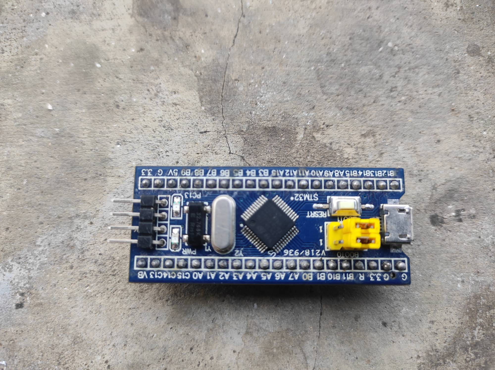
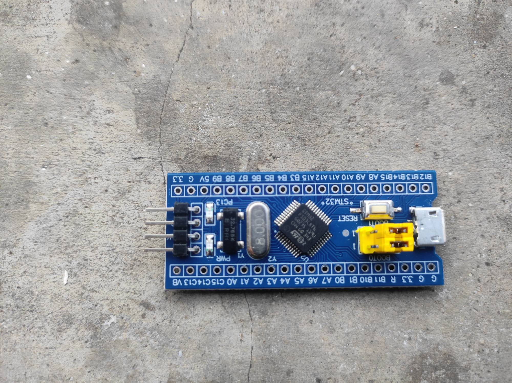
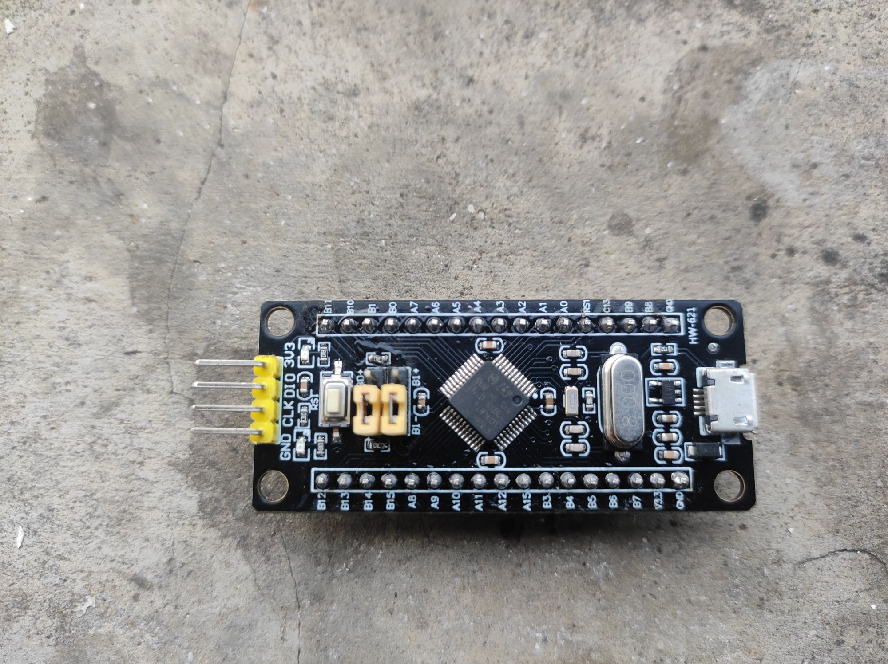
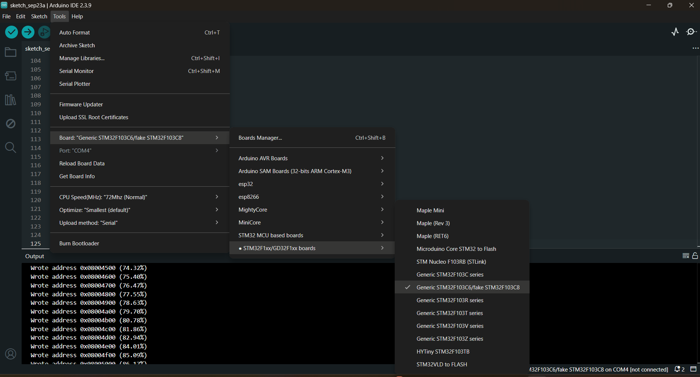
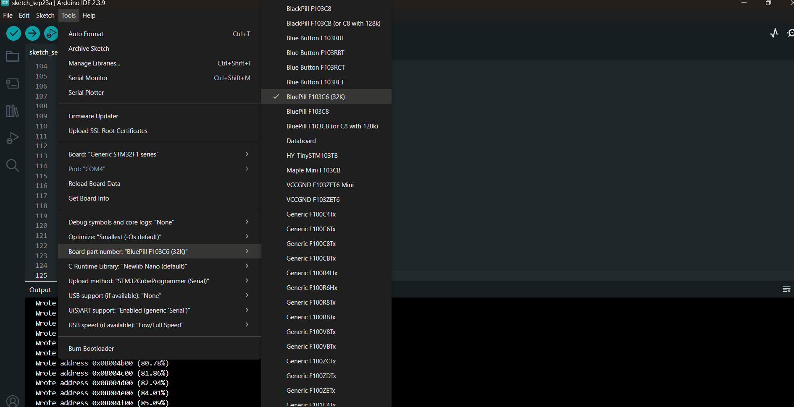
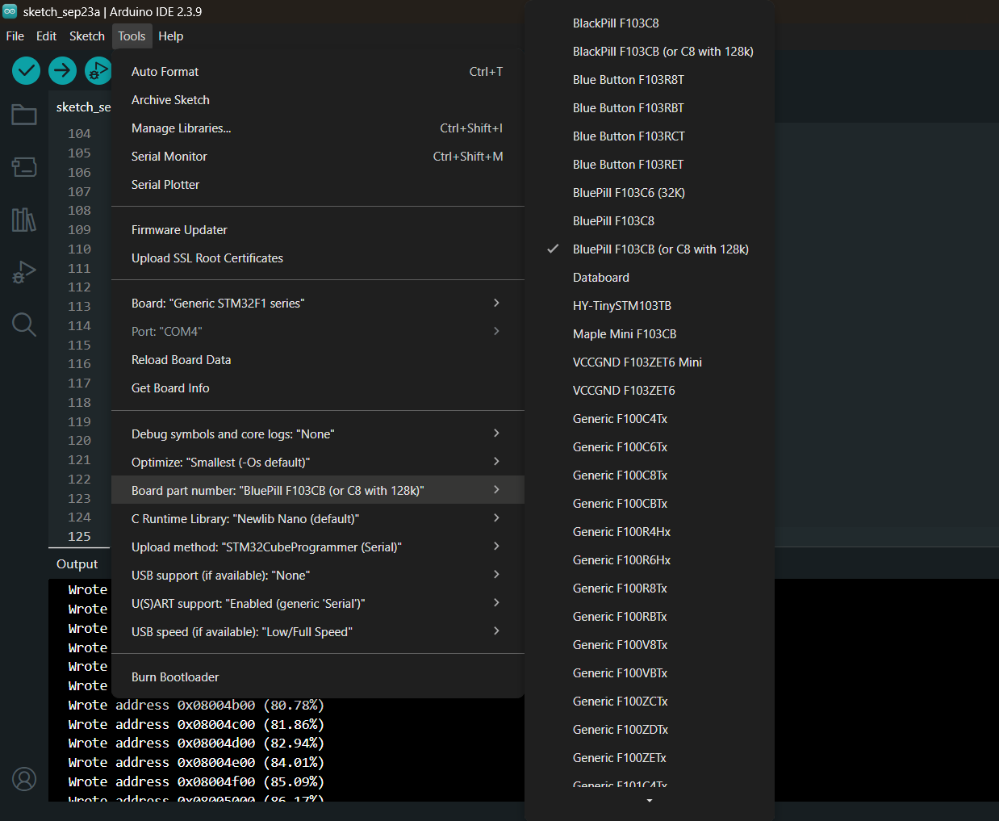
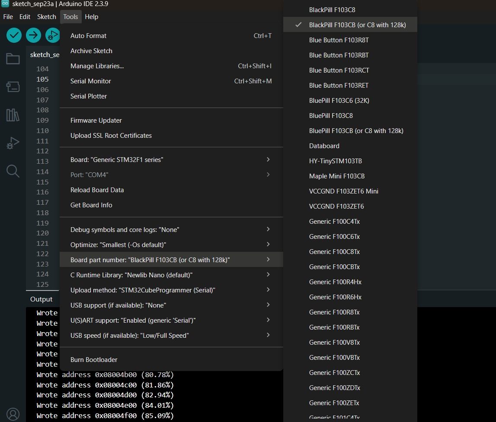

# Learning STM32: Three STM32F103 Boards in the Arduino IDE

Notes from programming three STM32F103 development boards in the **Arduino IDE 2.3.9** on Windows. All three boards have an STM32F103 chip, but they differ in:

- PCB color and layout
- the exact chip and its flash/RAM size
- the built-in LED pin
- the menu selection needed in the Arduino IDE

Each board was tested with:

- **2 Arduino cores:** the **Roger Clark core** (community, libmaple-based) and the **official STM32 core** (STMicroelectronics, HAL-based)
- **2 upload methods:** an **ST-Link V2** (SWD) and a **USB-to-TTL serial adapter** (built-in UART bootloader)

All 12 combinations (3 boards × 2 cores × 2 upload methods) work.

---

## Table of Contents

1. [Quick Comparison](#quick-comparison)
2. [Chip Differences (C6 vs C8 vs CB)](#chip-differences-c6-vs-c8-vs-cb)
3. [Arduino Cores Used](#arduino-cores-used)
4. [Board 1: Blue, STM32F103C6T6A](#board-1-blue-stm32f103c6t6a-older-board)
5. [Board 2: Blue, STM32F103C8T6](#board-2-blue-stm32f103c8t6)
6. [Board 3: Black, STM32F103CBT6](#board-3-black-stm32f103cbt6)
7. [Pinout Differences: Blue vs Black Board](#pinout-differences-blue-vs-black-board)
8. [Upload Method A: ST-Link V2](#upload-method-a-st-link-v2-swd)
9. [Upload Method B: USB-to-TTL Serial](#upload-method-b-usb-to-ttl-serial-adapter)
10. [Serial Monitor](#serial-monitor)
11. [Blink Test Sketch](#blink-test-sketch)
12. [Troubleshooting](#troubleshooting)
13. [Reference Links](#reference-links)

---

## Quick Comparison

| | **Board 1** | **Board 2** | **Board 3** |
|---|---|---|---|
| **Photo** |  |  |  |
| **PCB color** | Blue (older board) | Blue | Black (silkscreen "HW-621") |
| **Chip** | STM32F103**C6**T6A | STM32F103**C8**T6 | STM32F103**CB**T6 |
| **Flash / RAM (datasheet)** | 32 KB / 10 KB | 64 KB / 20 KB | 128 KB / 20 KB |
| **Built-in LED** | **PC13** | **PC13** | **PB12** |
| **Header pins** | 2 × 20 | 2 × 20 | 2 × 17 (no 5V, PC14, PC15, VBAT) |
| **Roger Clark core** | STM32F1xx/GD32F1xx boards → **Generic STM32F103C6/fake STM32F103C8** | same as Board 1 | same as Board 1 |
| **Official STM32 core** | Generic STM32F1 series → **BluePill F103C6 (32K)** | Generic STM32F1 series → **BluePill F103CB (or C8 with 128k)** | Generic STM32F1 series → **BlackPill F103CB (or C8 with 128k)** |
| **ST-Link upload** | ✅ Works | ✅ Works | ✅ Works |
| **USB-TTL serial upload** | ✅ Works | ✅ Works | ✅ Works |

> **Main differences:**
> - In the official core, only **Board 1** needs the **C6 (32K)** part number. Boards 2 and 3 use the **F103CB (or C8 with 128k)** part number.
> - Only **Board 3 (black)** has its LED on **PB12**. Boards 1 and 2 use **PC13**.
> - The **Roger Clark core** uses **the same board selection for all three boards**.

---

## Chip Differences (C6 vs C8 vs CB)

The letters after `STM32F103` describe the chip:

```
STM32 F 103  C   8   T  6
             │   │   │  └─ temperature range: 6 = -40…85 °C
             │   │   └──── package: T = LQFP
             │   └──────── flash size: 6 = 32 KB, 8 = 64 KB, B = 128 KB
             └──────────── pin count: C = 48 pins
```

All three chips are 72 MHz ARM Cortex-M3 parts in the same 48-pin package, so their pins match. The **C6** is a *low-density* device, so it has less memory **and fewer peripherals**:

| Feature | **C6** (Board 1) | **C8** (Board 2) | **CB** (Board 3) |
|---|---|---|---|
| Density class | Low-density | Medium-density | Medium-density |
| Flash | 32 KB | 64 KB | 128 KB |
| RAM | 10 KB | 20 KB | 20 KB |
| USART | 2 (USART1, USART2) | 3 (USART1–3) | 3 (USART1–3) |
| SPI | 1 (SPI1) | 2 (SPI1, SPI2) | 2 (SPI1, SPI2) |
| I²C | 1 (I2C1) | 2 (I2C1, I2C2) | 2 (I2C1, I2C2) |
| General-purpose timers | TIM2, TIM3 | TIM2, TIM3, TIM4 | TIM2, TIM3, TIM4 |
| Advanced timer | TIM1 | TIM1 | TIM1 |
| ADC | 2 × 12-bit, 10 channels | 2 × 12-bit, 10 channels | 2 × 12-bit, 10 channels |
| USB (full speed) / CAN | ✅ / ✅ | ✅ / ✅ | ✅ / ✅ |

> ⚠️ On **Board 1 (C6)**, `Serial3`, `SPI2` (PB12–PB15), `I2C2` (PB10/PB11) and `TIM4` (PB6–PB9 PWM) **do not exist**. Code that uses them compiles on the C8/CB boards but won't work on the C6.

> 📝 **About C8 chips with 128 KB:** many STM32F103**C8** chips contain 128 KB of flash, but ST only guarantees the first 64 KB. That's why the official core has a part number called "F103CB **(or C8 with 128k)**".

---

## Arduino Cores Used

Add both URLs in **File → Preferences → Additional Boards Manager URLs** (one per line):

```
https://dan.drown.org/stm32duino/package_STM32duino_index.json
https://github.com/stm32duino/BoardManagerFiles/raw/main/package_stmicroelectronics_index.json
```

Then open **Tools → Board → Boards Manager** and install both packages.

### 1. Roger Clark core (community "Arduino_STM32")

| | |
|---|---|
| **Boards Manager URL** | `https://dan.drown.org/stm32duino/package_STM32duino_index.json` |
| **Menu name in the IDE** | *Tools → Board → **STM32F1xx/GD32F1xx boards*** |
| **Source code** | https://github.com/rogerclarkmelbourne/Arduino_STM32 |
| **Based on** | libmaple (Leaflabs Maple), maintained by Roger Clark and the community |
| **Status** | Old and no longer actively developed, but still popular in Blue Pill tutorials. It's lightweight and compiles fast. |
| **Note** | It uses the ARM compiler from **Arduino SAM Boards (32-bits ARM Cortex-M3)**. Install that package too if compiling fails. |



*Roger Clark core: Tools → Board → STM32F1xx/GD32F1xx boards → Generic STM32F103C6/fake STM32F103C8.*

Settings used for all three boards:

| Tools menu | Selection |
|---|---|
| Board | **Generic STM32F103C6/fake STM32F103C8** |
| CPU Speed(MHz) | 72Mhz (Normal) |
| Optimize | Smallest (default) |
| Upload method | **Serial** (USB-TTL) *or* **STLink** (ST-Link V2) |
| Port | USB-TTL COM port (e.g. `COM4`). Only needed for Serial upload. |

### 2. Official STM32 core (STMicroelectronics "STM32duino")

| | |
|---|---|
| **Boards Manager URL** | `https://github.com/stm32duino/BoardManagerFiles/raw/main/package_stmicroelectronics_index.json` |
| **Menu name in the IDE** | *Tools → Board → **STM32 MCU based boards*** |
| **Source code** | https://github.com/stm32duino/Arduino_Core_STM32 |
| **Based on** | ST's official HAL / LL drivers (STM32Cube) |
| **Status** | Actively maintained by ST. Supports almost every STM32 family (F0, F1, F4, G0, L4, H7…). |
| **Note** | Uploading uses **STM32CubeProgrammer**, which must be installed separately: https://www.st.com/en/development-tools/stm32cubeprog.html |

Settings shared by all three boards (the only difference is **Board part number**):

| Tools menu | Selection |
|---|---|
| Board | **Generic STM32F1 series** |
| Board part number | *depends on the board, see below* |
| Debug symbols and core logs | None |
| Optimize | Smallest (-Os default) |
| C Runtime Library | Newlib Nano (default) |
| Upload method | **STM32CubeProgrammer (Serial)** (USB-TTL) *or* **STM32CubeProgrammer (SWD)** (ST-Link) |
| USB support (if available) | None |
| U(S)ART support | Enabled (generic 'Serial') |
| Port | USB-TTL COM port. Only needed for Serial upload. |

### Core comparison

| Feature | Roger Clark core | Official STM32 core |
|---|---|---|
| Maintained by | Community (Roger Clark and others) | STMicroelectronics |
| Board menu | *STM32F1xx/GD32F1xx boards* → *Generic STM32F103C6/fake STM32F103C8* | *STM32 MCU based boards* → *Generic STM32F1 series* → *Board part number* |
| Chip selection | In the board name | In the *Board part number* menu |
| ST-Link upload | *Upload method → STLink* | *Upload method → STM32CubeProgrammer (SWD)* |
| Serial upload | *Upload method → Serial* (uses `stm32flash`) | *Upload method → STM32CubeProgrammer (Serial)* |
| Extra software needed | Arduino SAM Boards package (compiler) | STM32CubeProgrammer |
| `LED_BUILTIN` | PC13 for this board selection | Set by the part number (PC13 for BluePill, PB12 for BlackPill) |
| Code size / compile speed | Smaller and faster | Larger (HAL), slower to compile |
| Families supported | STM32F1 (+ GD32F1) only | Almost every STM32 family |

> ⚠️ **Roger core on Boards 2 and 3:** "Generic STM32F103C6/fake STM32F103C8" builds for a C6 chip, so the compiler only allows **32 KB flash and 10 KB RAM**. This is fine for small sketches. For larger sketches on the C8/CB boards, pick **Generic STM32F103C series** and choose the 64k or 128k variant instead.

---

## Board 1: Blue, STM32F103C6T6A (older board)


| Property | Value |
|---|---|
| PCB color | Blue (older version, silkscreen "V218/936") |
| Chip | **STM32F103C6T6A** |
| Flash / RAM | **32 KB / 10 KB** (smallest of the three) |
| Built-in LED | **PC13** (plus a PWR LED) |
| Jumpers | BOOT0 / BOOT1 (yellow jumpers next to the micro-USB) |
| Crystals | 8 MHz main + 32.768 kHz RTC |
| Upload methods tested | ST-Link ✅, USB-TTL serial ✅ |

### Roger Clark core settings

See [Roger Clark core](#1-roger-clark-core-community-arduino_stm32): **Generic STM32F103C6/fake STM32F103C8**, Upload method **Serial** or **STLink**.

### Official STM32 core settings



| Tools menu | Selection |
|---|---|
| Board | **Generic STM32F1 series** |
| Board part number | **BluePill F103C6 (32K)** |
| Upload method | **STM32CubeProgrammer (SWD)** *or* **STM32CubeProgrammer (Serial)** |

> ⚠️ With only 32 KB of flash, large official-core sketches (e.g. ones using `Serial`, `Wire` and `SPI` together) run out of space quickly. Check the flash usage printed after each compile. The Roger core produces smaller code on this board.

---

## Board 2: Blue, STM32F103C8T6


| Property | Value |
|---|---|
| PCB color | Blue ("Blue Pill") |
| Chip | **STM32F103C8T6** (ST logo) |
| Flash / RAM | 64 KB / 20 KB per datasheet (many C8 chips actually contain 128 KB) |
| Built-in LED | **PC13** (plus a PWR LED) |
| Jumpers | BOOT0 / BOOT1 |
| Crystals | 8 MHz main + 32.768 kHz RTC |
| Upload methods tested | ST-Link ✅, USB-TTL serial ✅ |

### Roger Clark core settings

Same as Board 1: **Generic STM32F103C6/fake STM32F103C8**, Upload method **Serial** or **STLink**.

### Official STM32 core settings



| Tools menu | Selection |
|---|---|
| Board | **Generic STM32F1 series** |
| Board part number | **BluePill F103CB (or C8 with 128k)** |
| Upload method | **STM32CubeProgrammer (SWD)** *or* **STM32CubeProgrammer (Serial)** |

> 📝 The chip is marked **C8**, but this board is programmed with the **BluePill F103CB (or C8 with 128k)** option. "BluePill F103C8" and "BluePill F103CB" share the same pin mapping (PC13 LED, same pins). The only difference is the flash size the linker allows (64 KB vs 128 KB). If a sketch grows past 64 KB, the upload only works if the chip really has the extra flash.

---

## Board 3: Black, STM32F103CBT6


| Property | Value |
|---|---|
| PCB color | **Black** (silkscreen "HW-621") |
| Chip | **STM32F103CBT6** |
| Flash / RAM | **128 KB / 20 KB** (largest of the three) |
| Built-in LED | **PB12** ⚠️ (not PC13!) |
| Jumpers | **B0+ / B0−** and **B1+ / B1−** (jumper on "+" = 1, on "−" = 0) |
| SWD header | Yellow 4-pin: **3V3, DIO, CLK, GND** (labelled on the board) |
| Crystals | 8 MHz main + 32.768 kHz RTC |
| Upload methods tested | ST-Link ✅, USB-TTL serial ✅ |

### Roger Clark core settings

Same as Boards 1 and 2: **Generic STM32F103C6/fake STM32F103C8**, Upload method **Serial** or **STLink**.

> ⚠️ In the Roger core, `LED_BUILTIN` is **PC13**, but this board's LED is on **PB12**. Write `PB12` in your sketch.

### Official STM32 core settings



| Tools menu | Selection |
|---|---|
| Board | **Generic STM32F1 series** |
| Board part number | **BlackPill F103CB (or C8 with 128k)** |
| Upload method | **STM32CubeProgrammer (SWD)** *or* **STM32CubeProgrammer (Serial)** |

> 📝 **BlackPill vs BluePill part number:** both are the same F103CB chip, so both compile and upload. The difference is `LED_BUILTIN`:
> - **BlackPill F103CB** → `LED_BUILTIN = PB12` ✅ matches this board
> - **BluePill F103CB** → `LED_BUILTIN = PC13` ❌ the LED won't blink unless you write `PB12` yourself

---

## Pinout Differences: Blue vs Black Board

The chip pins are identical, but the boards break them out differently. These are the header labels as printed on my boards (with the SWD header on the left).

### Blue boards (Board 1 and Board 2): 2 × 20 pins

| Row | Pins (left → right) |
|---|---|
| **Top** | 3.3, G, 5V, B9, B8, B7, B6, B5, B4, B3, A15, A12, A11, A10, A9, A8, B15, B14, B13, B12 |
| **Bottom** | VB, C13, C14, C15, A0, A1, A2, A3, A4, A5, A6, A7, B0, B1, B10, B11, R, 3.3, G, G |

### Black board (Board 3, HW-621): 2 × 17 pins

| Row | Pins (left → right) |
|---|---|
| **Top** | B11, B10, B1, B0, A7, A6, A5, A4, A3, A2, A1, A0, RST, C13, B9, B8, GND |
| **Bottom** | B12, B13, B14, B15, A8, A9, A10, A11, A12, A15, B3, B4, B5, B6, B7, V3.3, GND |

### What's different

| | Blue boards | Black board |
|---|---|---|
| 5V pin | ✅ Yes | ❌ No. Power it from micro-USB or **V3.3** |
| PC14 / PC15 | ✅ Broken out | ❌ Not broken out (used by the 32.768 kHz crystal) |
| VBAT pin | ✅ VB | ❌ No |
| LED | PC13 | **PB12**. That pin is also SPI2_NSS, so the LED flickers if you use SPI2 |
| Boot jumpers | BOOT0 / BOOT1 | B0± / B1± |
| Mounting holes | ❌ | ✅ 4 holes |

> ⚠️ PA13/PA14 are the SWD pins. Don't use them as GPIO, or ST-Link uploads will need the "hold RESET" trick (see [Troubleshooting](#troubleshooting)).

---

## Upload Method A: ST-Link V2 (SWD)

Connect the ST-Link V2 to the 4-pin SWD header at the end of the board:

| ST-Link V2 | STM32 board |
|---|---|
| **3.3V** | 3.3 / 3V3 |
| **GND** | GND |
| **SWDIO** | DIO / IO (PA13) |
| **SWCLK** | CLK / DCLK (PA14) |

- Leave **BOOT0 = 0** (normal position). No jumper change is needed.
- **Roger core:** *Upload method → STLink*
- **Official core:** *Upload method → STM32CubeProgrammer (SWD)*. STM32CubeProgrammer must be installed.
- No COM port is needed.
- Install the ST-Link USB driver if Windows doesn't recognize the programmer: https://www.st.com/en/development-tools/stsw-link009.html

> The order of the 4 pins differs between boards and ST-Link clones. Always match by the **labels**, not by position.

---

## Upload Method B: USB-to-TTL Serial Adapter

This method uses the UART bootloader built into every STM32F103 ROM, on **USART1 = PA9 / PA10**. Any CH340, CP2102 or FT232 adapter works.

| USB-TTL adapter | STM32 board |
|---|---|
| **TX** | **A10** (PA10 = USART1 RX) |
| **RX** | **A9** (PA9 = USART1 TX) |
| **GND** | G / GND |
| **3.3V** (or 5V) | 3.3 (blue boards: 5V also possible · black board: **V3.3 only**) |

> TX goes to RX, and RX goes to TX. PA9/PA10 are 5V-tolerant, so 5V adapters also work.

**Upload steps:**

1. Set **BOOT0 = 1** (blue boards: BOOT0 jumper to 1 · black board: B0 jumper to **+**). Leave BOOT1 at 0.
2. Press the **RESET** button. The chip starts in the serial bootloader.
3. In the Arduino IDE, select the adapter's **COM port** in *Tools → Port* (e.g. `COM4`).
4. **Roger core:** *Upload method → Serial* · **Official core:** *Upload method → STM32CubeProgrammer (Serial)*
5. Click **Upload**. The output shows lines like `Wrote address 0x08004f00 (85.09%)`.
6. When the upload finishes, set **BOOT0 back to 0** and press **RESET** so the sketch runs normally.

> If you forget step 6, the board goes back into the bootloader on every reset and your sketch won't run.

### Boot modes

| BOOT1 | BOOT0 | Starts from | Used for |
|---|---|---|---|
| x | **0** | Main flash | Normal operation, ST-Link upload |
| **0** | **1** | System memory (ROM bootloader) | USB-TTL serial upload |
| 1 | 1 | SRAM | Not used here |

---

## Serial Monitor

With the settings above (*USB support: None*), `Serial` is **USART1 on PA9/PA10** in both cores. That's the same pins as the USB-TTL adapter, so after a serial upload (BOOT0 = 0, RESET) you can open **Tools → Serial Monitor** on the same COM port without re-wiring.

```cpp
void setup() {
  Serial.begin(115200);
}

void loop() {
  Serial.println("Hello from STM32F103");
  delay(1000);
}
```

> The micro-USB connector on these boards only provides **power** with these settings. USB serial (CDC) needs *USB support: CDC* in the official core or a USB bootloader in the Roger core. Many blue boards also have the wrong USB pull-up resistor (R10 = 10 kΩ instead of 1.5 kΩ), which can stop USB from being detected on some PCs.

---

## Blink Test Sketch

This sketch works on all three boards. Uncomment the line for the board you're using:

```cpp
// Choose the LED pin for your board
#define LED_PIN PC13      // Board 1 (blue C6) and Board 2 (blue C8)
// #define LED_PIN PB12   // Board 3 (black CB)

void setup() {
  pinMode(LED_PIN, OUTPUT);
}

void loop() {
  digitalWrite(LED_PIN, LOW);   // on-board LEDs are usually active-LOW: LOW = ON
  delay(500);
  digitalWrite(LED_PIN, HIGH);  // HIGH = OFF
  delay(500);
}
```

> With the official core and the correct part number (BluePill for boards 1–2, BlackPill for board 3), `LED_BUILTIN` already points to the right pin, so you can use it instead of `LED_PIN`.

---

## Troubleshooting

| Problem | Likely cause / fix |
|---|---|
| Upload succeeds but the LED doesn't blink on the black board | Wrong pin. The black board uses **PB12**. Use the **BlackPill** part number or write `PB12`. |
| Serial upload: "Failed to init device" / timeout | BOOT0 isn't set to 1, you didn't press RESET, TX/RX are swapped, or the wrong COM port is selected. |
| Sketch doesn't run after a serial upload | BOOT0 is still 1. Set it back to 0 and press RESET. |
| Official core: "STM32CubeProgrammer not found" | Install STM32CubeProgrammer in its default location and restart the Arduino IDE. |
| ST-Link: "No ST-Link detected" | Install the ST-Link driver (STSW-LINK009) and try another USB port or cable. |
| ST-Link: "Can not connect to target" | Check the SWDIO/SWCLK wiring. If the sketch reuses PA13/PA14, **hold RESET**, start the upload, and release RESET when "Uploading…" appears. Or upload once via serial with BOOT0 = 1. |
| "Sketch too big" / "region FLASH overflowed" | Board 1 (C6) has only 32 KB, and the Roger "C6/fake C8" selection also limits Boards 2–3 to 32 KB. Use a larger variant or cut down the sketch. |
| Code uses `Serial3`, `SPI2` or `Wire` on PB10/PB11 and fails on Board 1 | The C6 (low-density) chip doesn't have USART3, SPI2, I2C2 or TIM4. |
| Roger core fails to compile (missing `arm-none-eabi-gcc`) | Install **Arduino SAM Boards (32-bits ARM Cortex-M3)** from the Boards Manager. |
| "Port: COM4 [not connected]" in the status bar | Normal when the board is in bootloader mode or the adapter is unplugged. Re-select the port after plugging in. |

---

## Reference Links

**Arduino cores**
- Roger Clark core (Boards Manager URL): https://dan.drown.org/stm32duino/package_STM32duino_index.json
- Roger Clark core source: https://github.com/rogerclarkmelbourne/Arduino_STM32
- Roger Clark core wiki: https://github.com/rogerclarkmelbourne/Arduino_STM32/wiki
- Official STM32 core (Boards Manager URL): https://github.com/stm32duino/BoardManagerFiles/raw/main/package_stmicroelectronics_index.json
- Official STM32 core source: https://github.com/stm32duino/Arduino_Core_STM32
- Official STM32 core wiki: https://github.com/stm32duino/Arduino_Core_STM32/wiki
- Official core, F1 variants (BluePill / BlackPill pin definitions): https://github.com/stm32duino/Arduino_Core_STM32/tree/main/variants/STM32F1xx
- STM32duino forum: https://www.stm32duino.com/

**ST tools and drivers**
- STM32CubeProgrammer: https://www.st.com/en/development-tools/stm32cubeprog.html
- ST-Link V2 USB driver (STSW-LINK009): https://www.st.com/en/development-tools/stsw-link009.html
- CH340 USB-TTL driver: https://www.wch-ic.com/downloads/CH341SER_EXE.html
- CP210x USB-TTL driver: https://www.silabs.com/developers/usb-to-uart-bridge-vcp-drivers

**Datasheets / chip pages**
- STM32F103C6 (low-density, 32 KB): https://www.st.com/en/microcontrollers-microprocessors/stm32f103c6.html
- STM32F103C8 (medium-density, 64 KB): https://www.st.com/en/microcontrollers-microprocessors/stm32f103c8.html
- STM32F103CB (medium-density, 128 KB): https://www.st.com/en/microcontrollers-microprocessors/stm32f103cb.html
- STM32F103 reference manual (RM0008): https://www.st.com/resource/en/reference_manual/rm0008-stm32f101xx-stm32f102xx-stm32f103xx-stm32f105xx-and-stm32f107xx-advanced-armbased-32bit-mcus-stmicroelectronics.pdf
- AN2606, STM32 system memory boot mode (serial bootloader): https://www.st.com/resource/en/application_note/an2606-stm32-microcontroller-system-memory-boot-mode-stmicroelectronics.pdf

**Community board info**
- Blue Pill: https://stm32-base.org/boards/STM32F103C8T6-Blue-Pill.html
- Black Pill (F103): https://stm32-base.org/boards/STM32F103C8T6-Black-Pill.html
- All boards: https://stm32-base.org/boards/
